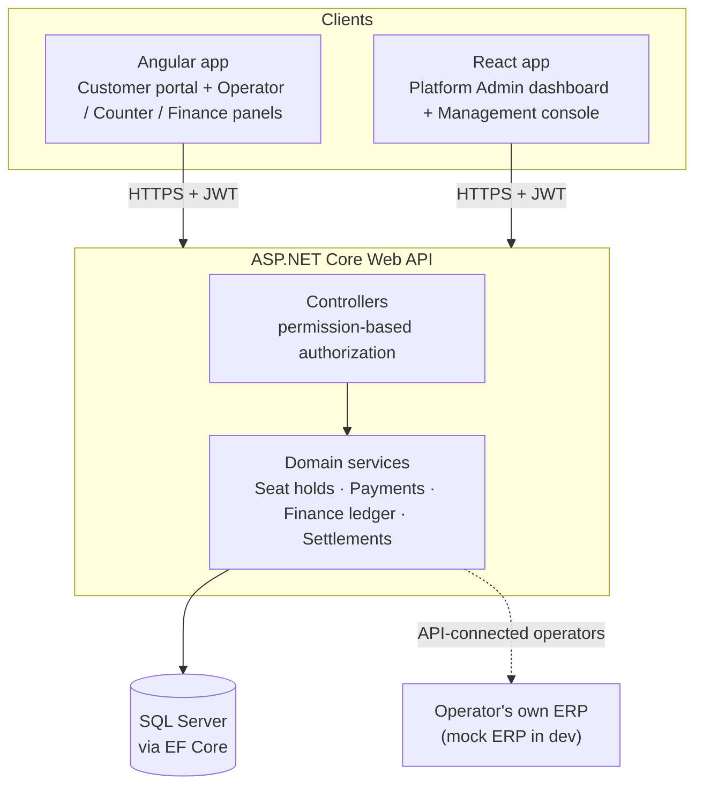

<div align="center">

# 🚌 TicketPortal

**A multi-operator bus ticket booking platform with built-in commission, settlement and invoicing.**

One website for passengers. One back-office for every bus company. One financial engine that keeps everyone's books straight.


</div>

---

## 📑 Table of Contents

- [About the Project](#-about-the-project)
- [Key Features](#-key-features)
- [Tech Stack](#-tech-stack)
- [System Architecture](#-system-architecture)
- [How the Money Flows](#-how-the-money-flows)
- [Project Structure](#-project-structure)
- [Getting Started](#-getting-started)
- [Demo Accounts](#-demo-accounts)
- [Running the Tests](#-running-the-tests)
- [Documentation](#-documentation)
- [Roadmap](#-roadmap)
- [Team](#-team)
- [License](#-license)

---

## 📖 About the Project

Bus travel is fragmented: every company has its own counter, its own website (or none), and its own way of handling seats and payments. Passengers have to check several places to compare options, and small operators often have no booking software at all.

**TicketPortal** is a *multi-tenant* marketplace that fixes this. Many bus operators plug into one shared platform, so a passenger searching **"Dhaka → Chattogram"** sees trips from *every* operator in a single list and books through one checkout. Operators get ready-made back-office tools, and the platform tracks who owes whom automatically.

Operators can join in one of two ways:

| Integration model | Who it's for | What TicketPortal handles |
|---|---|---|
| **Full-Platform** | Operators with no booking system of their own | Online sales **and** cash-counter (walk-in) sales, all recorded in TicketPortal |
| **API-Connected** | Operators with their own ERP | Online channel only — TicketPortal syncs seat availability and booking status with the operator's ERP through an API |

---

## ✨ Key Features

### 🧑‍💼 For Passengers
- **Unified route search** across all operators with live seat availability — browsing is public, login is only needed to hold seats
- **Interactive seat map** drawn from above (aisle, window seats, lower/upper deck for double-deckers)
- **Temporary seat hold (3–5 minutes)** — seats auto-release if payment isn't completed in time
- Checkout & payment, **QR-code tickets** with PDF download, wallet, cancellations and refunds
- Ticket verification, complaints, and bus discovery pages

### 🏢 For Bus Operators & Counter Staff
- Fleet, route, fare, trip, crew and counter management scoped to *their own* company
- **Walk-in cash sales** at the assigned sales counter, with printable receipts
- Boarding desk: passenger manifest and ticket check-in
- Trip cancellation with automatic cascade to affected bookings

### 💰 Financial Engine (a first-class module)
- Per-booking **commission** and **operator-due** calculation
- Platform ledger, invoices/bills at set intervals, payout processing
- **Net settlement**: nets what the platform owes an operator (online revenue − commission) against what the operator owes the platform (commission on counter sales)
- Payment architecture designed so new payment methods/providers can be added without rework

### 🛡️ For the Platform
- **Admin dashboard** with server-side KPIs and reports (React)
- Management console with CRUD for users, operators, routes, trips, coupons/offers/banners, commission & tax rules, payment providers, integrations, audit logs and login history
- **Fine-grained RBAC** — access is decided by job-role *permissions* (e.g. `Counter.Sell`, `Finance.Configure`), not just "is logged in as Staff"
- Security basics: JWT auth, login lockout, CORS allow-list, upload validation, Swagger and demo seeding restricted to Development

### 🔌 External ERP Integration
- Documented API contract for operators with their own ERP
- A **mock ERP server** with a scenario switch (success, seat unavailable, timeout, …) to demo rejection/timeout handling

---

## 🧰 Tech Stack

| Layer | Technology |
|---|---|
| **Backend** | ASP.NET Core Web API (.NET 10), ASP.NET Identity, JWT Bearer auth, Swagger (Swashbuckle) |
| **Database** | SQL Server (LocalDB for development), Entity Framework Core 10 |
| **Customer / staff portal** | Angular 22 (standalone components, signals) |
| **Admin dashboard & console** | React 19, Vite, TanStack Query, Tailwind CSS, Recharts |
| **Shared code** | TypeScript models and design tokens shared by both frontends |
| **Mock ERP** | Node.js + Express |
| **Testing** | xUnit + `WebApplicationFactory` integration tests |
| **Tooling** | Nx monorepo, ESLint, Prettier |

---

## 🏗 System Architecture



> More diagrams (seat-hold lifecycle, check-in, settlement flow) are in [`docs/DIAGRAMS.md`](docs/DIAGRAMS.md).

---

## 💸 How the Money Flows

Money moves in opposite directions depending on the sales channel — this asymmetry is the core of the business model.

| Channel | Where the cash goes first | Who bills whom |
|---|---|---|
| **Online sale** | Into **TicketPortal's** account | Platform keeps its commission and pays the operator the rest on the invoice cycle |
| **Counter (walk-in) sale** — Full-Platform operators only | Straight to the **operator** | Platform records the sale and bills the operator a software/ERP commission afterwards |

The **Net Settlement Engine** reconciles both directions per operator and produces one final figure: *who pays whom, and how much.* See [`FINANCIAL_RULES_AND_EXAMPLES.md`](FINANCIAL_RULES_AND_EXAMPLES.md) for worked examples.

---

## 📁 Project Structure

```
TicketPortal/
├── apps/
│   ├── api/          ASP.NET Core Web API (controllers, services, EF Core models, migrations)
│   ├── api.tests/    xUnit test suite (unit, integration, architecture tests)
│   ├── frontend/     Angular app — customer portal + operator / counter / finance panels
│   ├── admin/        React app — platform admin dashboard + management console
│   └── mock-erp/     Node/Express fake operator ERP for the API-connected demo
├── libs/shared/
│   ├── models/       TypeScript interfaces & enums that mirror the backend DTOs
│   └── design-tokens/  Shared colours, spacing and component classes for both frontends
├── docs/             Diagrams, ERP contract, test matrix, demo script, …
├── scripts/          Demo-database reset scripts
└── *.md              Setup guide, demo accounts, role/permission matrix, financial rules
```

---

## 🚀 Getting Started

### Prerequisites

| Tool | Version | Notes |
|---|---|---|
| Node.js | 22+ | Runs Nx, Angular, React and the mock ERP |
| .NET SDK | 10 | Builds and runs the API |
| SQL Server LocalDB | — | Installed with Visual Studio (Windows). On macOS/Linux use a SQL Server Docker image and update the connection string |
| Git | any | |

### 1. Clone and install

```bash
git clone https://github.com/AsrafujjamanDeepu/TicketPortal.git
cd TicketPortal
npm ci
```

### 2. Trust the HTTPS dev certificate (once)

```bash
dotnet dev-certs https --trust
```

### 3. Start the apps (one terminal each)

```bash
# Backend API  → https://localhost:54221/swagger
npx nx run api:serve

# Customer / staff portal (Angular)  → http://localhost:4200
npx nx serve frontend

# Admin dashboard (React)  → http://localhost:4300   (management console: /admin)
npx nx serve admin

# Optional: mock ERP for the API-connected operator demo  → http://localhost:5099
cd apps/mock-erp && npm install && npm start
```

On its first start the API creates the `TicketPortalDB` LocalDB database, applies migrations and **seeds demo data** (operators, buses, trips, terminals, staff, accounts) — no manual database setup needed.

### 4. Reset the demo database (optional)

```powershell
./scripts/reset-demo-db.ps1     # Windows
```
```bash
./scripts/reset-demo-db.sh      # macOS / Linux
```

These scripts only run against LocalDB in the Development environment, so they can't be pointed at a real database by accident.

### Configuration & secrets

Development works out of the box. For any **non-Development** environment the API refuses to start without a real JWT signing key:

```bash
dotnet user-secrets set "JWT:SigningKey" "<random string, 32+ characters>" --project apps/api
# or
export JWT__SigningKey="<random string, 32+ characters>"
```

Set SMTP passwords and payment/ERP keys the same way — never in `appsettings.json`. Full details in [`SETUP_AND_DEMO_GUIDE.md`](SETUP_AND_DEMO_GUIDE.md), including a troubleshooting table for common login problems.

---

## 🔑 Demo Accounts

> ⚠️ Demo-only credentials seeded into a **local** development database. Never reuse them anywhere else.

| Role | Username | Password | Try this |
|---|---|---|---|
| Platform Admin | `admin` | `Admin@12345` | Admin dashboard + management console |
| Customer | `rahim.uddin` | `Demo@12345` | Search → hold seats → pay → view QR ticket |
| Counter staff (Green Line) | `selina.counter.gl` | `Demo@12345` | Walk-in cash sale at the Gabtoli counter |
| Operator manager (Green Line) | `abdul.karim.gl` | `Demo@12345` | Own fleet, trips, fares and earnings |
| Platform finance | `nusrat.finance` | `Demo@12345` | Reconciliation, settlements, payouts |

The complete list of accounts, with what each role can and cannot do, is in [`DEMO_ACCOUNTS.md`](DEMO_ACCOUNTS.md).

### 10-minute smoke test

1. Log in to the admin app as `admin` → open the Management Console → dashboard and lists load.
2. In the Angular portal, log in as `rahim.uddin` → search **Dhaka → Chattogram** → pick a trip → select seats (hold timer starts) → pay → open **My Tickets** for the QR/PDF.
3. Log in as `selina.counter.gl` → **Counter Desk → Walk-in Booking**.
4. Let a seat hold expire and confirm the seats become available again.

---

## 🧪 Running the Tests

```bash
npx nx run api.tests:restore   # first time only
npx nx run api.tests:test
```

The xUnit suite exercises the real API over HTTP (`WebApplicationFactory`) against a fresh LocalDB database, covering seat-hold concurrency and expiry, trip-state gating, ticket check-in, finance-ledger and settlement formulas, and RBAC allow/deny cases.

Frontend checks and a full build:

```bash
npx nx run-many -t lint,typecheck,build -p frontend,admin
```

See [`docs/FINAL_TEST_MATRIX.md`](docs/FINAL_TEST_MATRIX.md) for what is covered.

---

## 📚 Documentation

| Document | What's inside |
|---|---|
| [`SETUP_AND_DEMO_GUIDE.md`](SETUP_AND_DEMO_GUIDE.md) | Full setup, secrets, troubleshooting, deployment notes |
| [`DEMO_ACCOUNTS.md`](DEMO_ACCOUNTS.md) | Every seeded account and what it demonstrates |
| [`ROLE_PERMISSION_MATRIX.md`](ROLE_PERMISSION_MATRIX.md) | Which role can do what |
| [`AUTHORIZATION_DECISIONS.md`](AUTHORIZATION_DECISIONS.md) | Why authorization is designed the way it is |
| [`FINANCIAL_RULES_AND_EXAMPLES.md`](FINANCIAL_RULES_AND_EXAMPLES.md) | Commission, ledger and settlement rules with worked examples |
| [`docs/DIAGRAMS.md`](docs/DIAGRAMS.md) | Architecture, seat-hold and settlement diagrams |
| [`docs/EXTERNAL_ERP_INTEGRATION_CONTRACT.md`](docs/EXTERNAL_ERP_INTEGRATION_CONTRACT.md) | API contract for operators with their own ERP |
| [`docs/ADMIN_DASHBOARD_DATA_MAP.md`](docs/ADMIN_DASHBOARD_DATA_MAP.md) | Where every dashboard number comes from |
| [`docs/FINAL_DEMO_SCRIPT.md`](docs/FINAL_DEMO_SCRIPT.md) | Step-by-step demo walkthrough |

---

## 🗺 Roadmap

- [ ] Crew-facing screens for drivers and helpers (currently HR data only)
- [ ] Additional payment providers/methods (the architecture already supports plugging them in)
- [ ] CI pipeline running lint, build and the API test suite on every pull request
- [ ] Full entity-relationship diagram of all models
- [ ] Production deployment with real payment gateway credentials

---

## 👥 Team

| Name | Role |
|---|---|
| **Asrafujjaman Deepu (Zaman)** | Team Leader · Full-Stack Development |
| _Teammate name_ | _Their part of the project_ |
| _Teammate name_ | _Their part of the project_ |

<!-- Add one row per teammate. Delete the placeholder rows above. -->

---

## 📄 License

Released under the [MIT License](LICENSE).

<div align="center">

Built as a final project · September 2026

</div>
