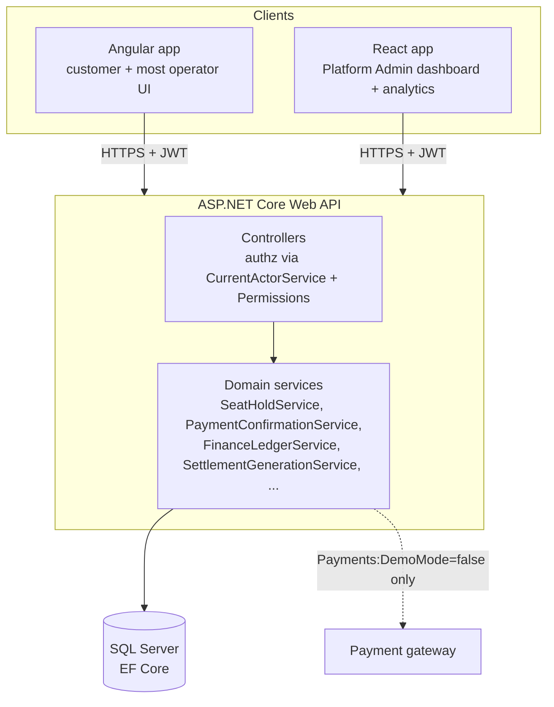
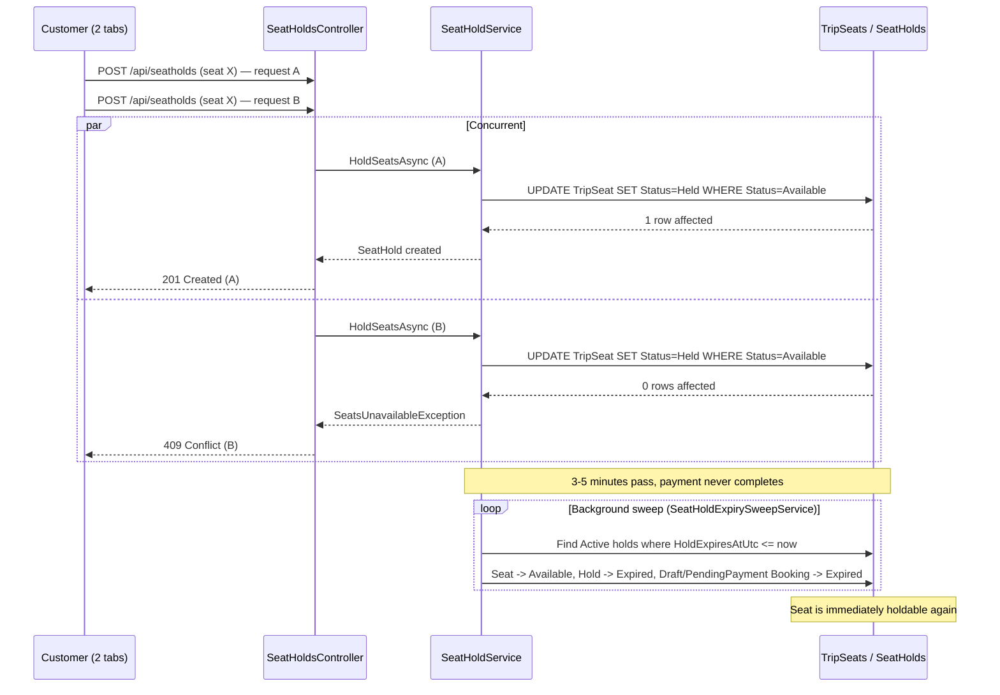
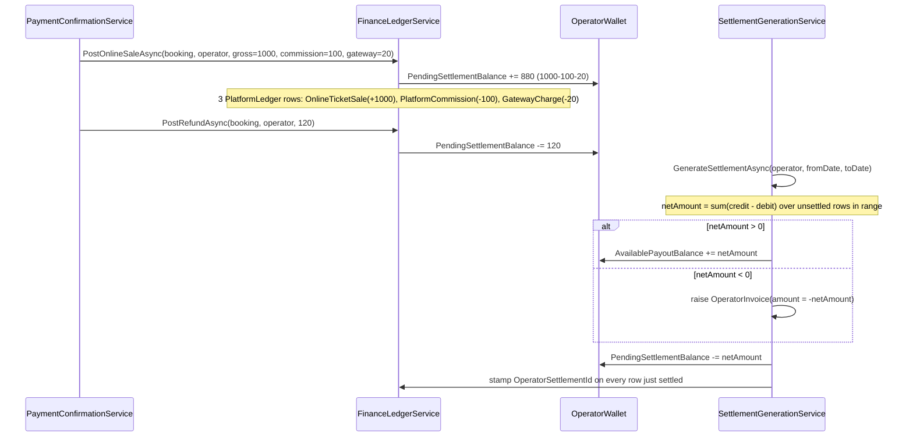
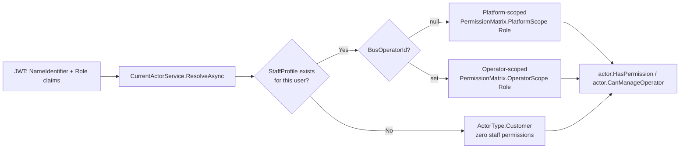

# Diagrams — Chunk 10

Scoped to the flows this pass actually traced through the real source (seat holds, check-in,
finance/settlement, and the layered architecture) — not a full ERD of all ~84 models, which
would need a dedicated pass to verify accurately rather than guess at from partial reads.

## System architecture (high level)

## Seat hold lifecycle (verified via `apps/api.tests/Integration/SeatHold*Tests.cs`)

## Online sale → refund → settlement (verified via `FinanceLedgerServiceTests` / `SettlementGenerationServiceTests`)

## Authorization resolution (`CurrentActorService` / `PermissionMatrix`)

## Not covered here

A full entity-relationship diagram of the ~84 models was not attempted this pass — a
diagram built from a partial read of the schema risks being confidently wrong in exactly the
way that misleads someone using it as a reference. If a full ERD is wanted, it should be
generated from the actual EF model (e.g. via `dotnet ef dbcontext info` / a proper
schema-diagram tool run against a real migrated database) rather than hand-drawn.
